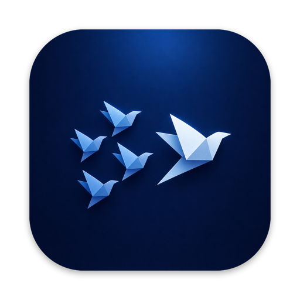

<div align="center">
  
  <h1>OpenFlock</h1>
  <p><strong>Watch your flock of AI coding agents:<br>
  throughput, token burn, usage limits, and who needs you.</strong></p>
  <p>
    
    
    
    
    <a href="LICENSE"></a>
  </p>
  <p><a href="#why">Why</a> · <a href="#install">Install</a> · <a href="#status">Status</a> · <a href="#license">License</a></p>
</div>

## Why

If you run multiple coding agents in parallel — across terminal sessions today,
web and mobile eventually — there's no single glanceable place that answers:

- How many agents are running, and on which models?
- How many tokens has each agent's session consumed?
- Which agents are active, and which are blocked waiting on me?
- Where am I against my session/weekly usage limits?
- At my current burn rate, do I run out before the limit resets?

Session control already exists (Claude Code's Agent View). OpenFlock is the
**observation and economics layer**: it tells you an agent stopped or that
you'll hit your weekly limit by Thursday — you decide what to do about it.

## Install

```sh
brew tap bobby-oster/openflock
brew trust bobby-oster/openflock   # Homebrew 6+ requires trusting third-party taps
brew install --cask openflock
```

OpenFlock is ad-hoc signed but not yet notarized, so macOS Gatekeeper blocks the
first launch. After installing, clear the quarantine flag:

```sh
xattr -dr com.apple.quarantine /Applications/OpenFlock.app
```

or open it once via **System Settings → Privacy & Security → "Open Anyway"**.
Universal binary (Apple Silicon + Intel); requires macOS 14 (Sonoma) or later.

## Status

Pre-alpha, but running. A SwiftPM workspace with a `FlockCore` library and a
macOS menu bar app (`OpenFlockApp`) is in place. What works today:

- Watches **Claude Code** (`~/.claude/projects`) and **Codex**
  (`~/.codex/sessions`) sessions through one transcript-source abstraction, so
  a mixed fleet shows up in a single list — each row carries a producer badge
  when both are present.
- Per-agent state read from the shape of the last transcript event, not file
  mtime: **working** (mid-turn), **waiting** (turn ended, your move),
  **blocked** (a tool call left pending — usually a permission prompt), and
  **stale** (no model activity for ~an hour — *inferred* backgrounded or
  abandoned). The same state logic runs for both producers, and the menu bar
  leads with whatever needs attention.
- Session list titled by project directory, leading with output tokens
  (cache-inclusive totals on the secondary line); synthetic and empty
  sessions are filtered out. Claude Code sub-agent transcripts fold into their
  parent session; Codex sessions stand alone.
- Throughput: fresh-token (input + output) burn rate now and as a 10-minute
  average, with cache-inclusive rate as a secondary figure and an optional
  compact rate in the menu bar label. Token counts are normalized per producer
  so Codex's nested totals aren't double-counted.
- Panel components (throughput, session list, menu bar rate) individually
  toggleable, persisted across launches.

Not yet built: usage-limit tracking, Codex sub-agent grouping, and anything
beyond terminal sessions (web and mobile eventually). macOS first.

## Name styling

One rule, applied everywhere: **OpenFlock** for humans (prose, app name),
**`openflock`** for machines (repo, binary, package, formula). Never hyphenated.

## License

[MIT](LICENSE)
